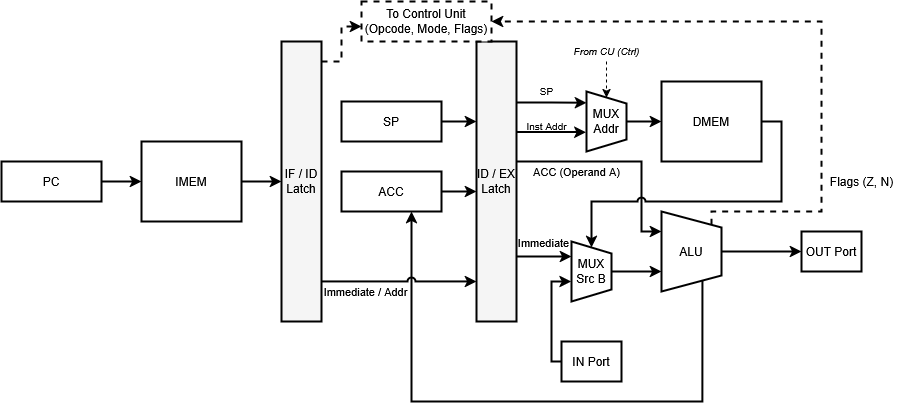
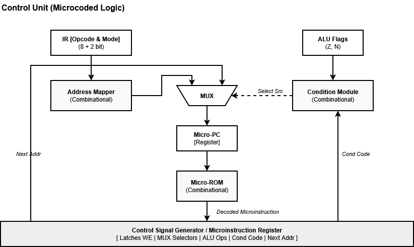

# csa_lab4

- ФИО: `Караганов Павел Эдуардович P3210`
- Вариант: `lisp | acc | harv | mc | tick | binary | stream | port | cstr | prob1 | pipeline`
  * `lisp` : Синтаксис языка Lisp. S-exp:
    1. Поддержка рекурсивных функций.
    2. Любое выражение (statement) - expression.
  * `acc` : Система команд должна быть выстроена вокруг аккумулятора:
    1. Инструкции - изменяют значение, хранимое в аккумуляторе.
    2. Ввод-вывод осуществляется через аккумулятор.
  * `harv` : Гарвардская архитектура.
  * `mc` : Команды реализованы с помощью микрокоманд.
  * `tick` : Процессор необходимо моделировать с точностью до такта, процесс моделирования может быть приостановлен на любом такте.
  * `binary` : Бинарное представление машинного кода.
  * `stream` : Ввод-вывод осуществляется как поток токенов.
  * `port` : Port-mapped (специальные инструкции для ввода-вывода).
  * `cstr` : Null-terminated (C string).
  * `prob1` : Euler problem 4 [link](https://projecteuler.net/problem=4).
  * `pipeline` : Конвейерная организация работы процессора:
    * Количество стадий конвейера - не менее 3.

## Язык Lisp

Синтаксис основан на S-выражениях (S-exp). Каждая конструкция записывается в виде списка в круглых скобках и возвращает значение. Транслятор осуществляет построение Абстрактного Синтаксического Дерева (AST) для дальнейшего анализа и генерации кода.

### Формальная грамматика (EBNF)

```ebnf
<program> ::= <expression>*

<expression> ::= <number>
               | <string>
               | <identifier>
               | <list>

<list> ::= "(" <operator> <expression>* ")"
         | "(" <identifier> <expression>* ")"

<operator> ::= "defvar" | "setq" | "defun" | "if" | "loop" | "return"
             | "print" | "in" | "out" 
             | "+" | "-" | "*" | "/" | "mod" 
             | "=" | "!=" | "<" | ">"

<identifier> ::= [a-zA-Z_][a-zA-Z0-9_-]*
<number> ::= [-+]?[0-9]+
<string> ::= '"' [^"]* '"'
```

*Примечание: `<list>` может начинаться либо со встроенного оператора, либо с `<identifier>` (в случае вызова пользовательской функции).*

### Семантика

*   **Стратегия вычислений:** Строгая (аппликативный порядок). Аргументы функций и операторов вычисляются слева направо перед выполнением самой операции.
*   **Все является выражением:** Любая конструкция (включая `if`, `setq`, `loop`) возвращает значение. Результатом выполнения блока кода или функции является значение последнего вычисленного в нем выражения.
*   **Области видимости:**
    *   **Глобальная:** Переменные, объявленные через `defvar`, доступны во всей программе.
    *   **Локальная (Функциональная):** Аргументы функций и переменные, определенные внутри `defun`, доступны только внутри этой функции.
    *   **Статическая:** Область видимости определяется местом определения в коде. Поддерживается **рекурсия** — функции могут вызывать сами себя, при этом каждый вызов создает новый кадр на программном стеке.
*   **Типизация:** Динамическая типизация на уровне синтаксиса отсутствует. Все данные трактуются как 32-битные знаковые целые числа.
*   **Управление потоком:**
    *   `if` — вычисляет предикат; если он не равен 0, выполняется первая ветка, иначе — вторая.
    *   `loop` — бесконечный цикл, выход из которого осуществляется через оператор `return`.
    *   `return` — немедленно прерывает выполнение цикла или функции и возвращает указанное значение.
*   **Строки (Null-terminated - `cstr`):** Записываются в двойных кавычках. При трансляции символы последовательно размещаются в статической памяти данных, завершаясь нулевым байтом `\0`. Выражение строки возвращает адрес её первого символа (указатель).
*   **Ввод-вывод (Port-mapped):** Осуществляется через встроенные функции:
    *   `(in <port>)` — чтение значения из порта ввода (ввод токена из `stream`).
    *   `(out <port> <value>)` — запись значения в порт вывода.

## Организация памяти

* Модель: **Гарвардская архитектура** (память инструкций и память данных физически разделены). 
* Тип памяти: Однопортовая для каждого модуля. 
* Машинное слово: 32 бита.

```text
       Instruction Memory (IMEM)
+----------------------------------------+
| 0x0000 : JMP _start                    | <- Точка входа
| 0x0001 : ...                           | 
| ...                                    |
| 0x002A : _start: LD #1                 | <- Скомпилированные инструкции
| 0x002B : CALL solve                    | 
| ...                                    |
+----------------------------------------+

              Data Memory (DMEM)
+----------------------------------------+
| 0x0000 : 72  ('H')                     | \
| 0x0001 : 105 ('i')                     | | <- 1. Статические данные (0x0000 - 0x0FFF).
| 0x0002 : 0   ('\0')                    | |    Здесь лежат нуль-терминированные строки (cstr)
| ...                                    | /
|----------------------------------------|
| 0x1000 : variable_sum                  | \
| 0x1001 : variable_i                    | | <- 2. Глобальные переменные (0x1000 - 0x7FFF).
| ...                                    | /    Определяются через (defvar ...)
|----------------------------------------|
|                  ...                   |
|           (Свободная память)           |
|                  ...                   |
|----------------------------------------|
| 0xFFFD : local_var_temp                | \ 
| 0xFFFE : arg_limit                     | | <- 3. Стек вызовов (растет вверх, к 0x1000).
| 0xFFFF : ret_addr_main                 | |    Вершина стека указывается регистром SP.
+----------------------------------------+
```

### Механика отображения программы на процессор:
1. **Инструкции:** Компилятор генерирует последовательность 32-битных машинных слов и загружает их в `Instruction Memory`. Процессор выполняет их линейно, запрашивая по адресу из регистра `PC`.
2. **Строки (`cstr`):** При обнаружении строкового литерала (например, `"Hi"`), компилятор посимвольно сохраняет его в статический сегмент памяти данных, завершая нулем (`\0`). В коде инструкции вместо самой строки используется адрес первого символа (`0x0000`). Из-за упрощения модели, один 8-битный символ занимает целое 32-битное машинное слово.
3. **Глобальные переменные:** Размещаются статически, начиная с адреса `0x1000`. Транслятор заменяет имена переменных на их фиксированные адреса.
4. **Локальные переменные и рекурсия:** Размещаются динамически на стеке (начиная с `0xFFFF` и двигаясь в сторону уменьшения адресов). Доступ к ним осуществляется через относительное смещение от текущего значения регистра `SP` (Stack Pointer). При вызове функции на стек сохраняется адрес возврата.

## Система команд

### Особенности процессора
- **Аккумуляторная архитектура (`acc`):** Основным операндом всех АЛУ-операций является регистр `ACC`. Второй операнд берется либо из инструкции (Immediate), либо из памяти данных.
- **Портовый ввод-вывод (`port`):** Выделенное адресное пространство портов, доступное через специальные команды `IN` и `OUT`.
- **Конвейер (`pipeline`):** 3 стадии (Instruction Fetch, Decode/Memory Read, Execute/Write-Back).

### Набор инструкций

| Мнемоника | Операнд | Описание | Тактов* |
|:---|:---|:---|:---|
| **Загрузка/Запись** | | | |
| `LD` | `addr` | `ACC <- DMEM[addr]` | 1 |
| `LD` | `#val` | `ACC <- val` | 1 |
| `LD` | `[addr]` | `ACC <- DMEM[DMEM[addr]]` | 2 (stall) |
| `ST` | `addr` | `DMEM[addr] <- ACC` | 1 |
| `ST` | `[addr]` | `DMEM[DMEM[addr]] <- ACC` | 2 (stall) |
| **Арифметика** | | | |
| `ADD` | `addr/#val` | `ACC <- ACC + operand` | 1 |
| `SUB` | `addr/#val` | `ACC <- ACC - operand` | 1 |
| `MUL` | `addr/#val` | `ACC <- ACC * operand` | 1 |
| `DIV` | `addr/#val` | `ACC <- ACC / operand` | 1 |
| `MOD` | `addr/#val` | `ACC <- ACC % operand` | 1 |
| `CMP` | `addr/#val` | Выставить флаги на основе `ACC - operand` | 1 |
| **Управление** | | | |
| `JMP` | `addr` | `PC <- addr` | 1 (flush) |
| `JZ` | `addr` | Переход, если флаг `Z = 1` | 1 (flush**) |
| `JNZ` | `addr` | Переход, если флаг `Z = 0` | 1 (flush**) |
| `JLT` | `addr` | Переход, если флаг `N = 1` | 1 (flush**) |
| `JGT` | `addr` | Переход, если `Z=0` и `N=0` (результат больше 0) | 1 (flush**) |
| **Стек и Функции** | | | |
| `PUSH` | - | `DMEM[SP] <- ACC; SP <- SP - 1` | 2 (stall) |
| `POP` | - | `SP <- SP + 1; ACC <- DMEM[SP]` | 2 (stall) |
| `CALL` | `addr` | `PUSH PC; PC <- addr` | 2 (stall/flush) |
| `RET` | - | `POP PC` | 2 (stall/flush) |
| **Ввод-Вывод** | | | |
| `IN` | `port` | `ACC <- PORT[port]` | 1 |
| `OUT` | `port` | `PORT[port] <- ACC` | 1 |
| `HALT` | - | Остановка процессора | 1 |


### Пояснения:

*   **`* Тактов`**: Указано количество тактов на исполнение одной стадии инструкции. Благодаря конвейеру, в идеальном случае (линейный код) процессор завершает одну инструкцию за каждый такт.
*   **`stall`**: Команды со стеком (`PUSH`/`POP`) и косвенная адресация (`LD [addr]`) требуют двух обращений к памяти или сложных манипуляций с регистрами. Микрокод в этих случаях приостанавливает стадию выборки (IF), пока стадия выполнения (EX) завершает операцию.
*   **`flush`**: При выполнении перехода инструкции, которые уже попали в конвейер (стадии IF и ID), становятся невалидными. Процессор очищает конвейер и начинает выборку с нового адреса `PC`.
*   **`flush**`**: Для условных переходов сброс происходит только в том случае, если условие выполнилось (переход совершен).

### Кодирование инструкций

**Бинарное представление (`binary`)**: Машинное слово — 32 бита.
```text
┌─────────┬───────┬───────────────────────────────────────────────────────┐
│ 31...24 │ 23 23 | 21                       ...                        0 │
├─────────┼───────┼───────────────────────────────────────────────────────┤
│  Opcode │  Mode |            адрес памяти / значение (операнд)          │
└─────────┴───────┴───────────────────────────────────────────────────────┘
   (8 бит)  (2 бит)                      (22 бита)
```

1.  **Opcode (8 бит, 31–24):** Код операции. Определяет основное действие инструкции. Всего доступно 256 кодов.
2.  **Addressing Mode (2 бита, 23–22):** Определяет, как интерпретировать поле аргумента. Это критически важно для работы с переменными и стеком.
3.  **Argument / Address (22 бита, 21–0):** Содержит числовое значение, адрес памяти или смещение. Поддерживает знаковые значения (2-s complement) в режиме `Immediate`.

### Режимы адресации (`Mode`)

| Биты | Режим | Описание | Применение |
|:---:|:---|:---|:---|
| **00** | **Immediate** | Операнд находится прямо в инструкции. | Загрузка констант, арифметика с числами (`LD #10`). |
| **01** | **Direct** | В поле аргумента — абсолютный адрес в DMEM. | Глобальные переменные (`defvar`). |
| **10** | **Indirect** | В аргументе адрес ячейки, где лежит целевой адрес. | Работа с указателями и строками (`cstr`). |
| **11** | **Relative** | Адрес вычисляется как `SP + Argument`. | Доступ к локальным переменным и аргументам функций на стеке. |

### Таблица кодов операций (`Opcode`)

| Команда | Opcode (HEX) | Описание |
|:---|:---|:---|
| `HALT` | `0x00` | Остановка процессора. |
| `LD`   | `0x01` | Загрузить значение в ACC. |
| `ST`   | `0x02` | Сохранить значение из ACC в память данных. |
| `ADD`  | `0x10` | Сложение: `ACC <- ACC + operand`. |
| `SUB`  | `0x11` | Вычитание: `ACC <- ACC - operand`. |
| `MUL`  | `0x12` | Умножение: `ACC <- ACC * operand`. |
| `DIV`  | `0x13` | Деление: `ACC <- ACC / operand`. |
| `MOD`  | `0x14` | Остаток от деления. |
| `CMP`  | `0x15` | Сравнение (выставляет флаги Z и N). |
| `JMP`  | `0x20` | Безусловный переход. |
| `JZ`   | `0x21` | Переход, если результат равен 0 (Z=1). |
| `JNZ`  | `0x22` | Переход, если результат не равен 0 (Z=0). |
| `JLT`  | `0x23` | Переход, если результат меньше 0 (N=1). |
| `JGT`  | `0x24` | Переход, если результат больше 0 (Z=0, N=0). |
| `CALL` | `0x30` | Вызов подпрограммы (сохранение PC на стек). |
| `RET`  | `0x31` | Возврат из подпрограммы (восстановление PC). |
| `PUSH` | `0x32` | Поместить значение ACC на вершину стека. |
| `POP`  | `0x33` | Извлечь значение с вершины стека в ACC. |
| `IN`   | `0x40` | Чтение данных из порта ввода в ACC. |
| `OUT`  | `0x41` | Вывод значения ACC в порт вывода. |

**Пример кодирования:**
Команда: `LD #42` (Загрузить константу 42 в аккумулятор)
*   `Opcode`: `LD` = `0x01` (`0000 0001` bin)
*   `Mode`: `Immediate` = `0x0` (`00` bin)
*   `Argument`: `42` (`0000000000000000101010` bin)

**Результат (HEX):** `0x0100002A`

## Транслятор

Интерфейс командной строки: `python translator.py <input.lisp> <target.bin> [target.asm]`

Реализация транслятора разделена на три логических этапа (прохода), что обеспечивает независимость синтаксического разбора от генерации машинного кода.

### Этапы трансляции:

1.  **Синтаксический анализ:**
    *   Текст программы разбивается на токены.
    *   Построение **AST (Abstract Syntax Tree)** в виде вложенных списков. На этом этапе проверяется парность скобок и корректность структуры S-выражений.
2.  **Анализ семантики:**
    *   **Регистрация символов:** Формируется таблица имен (глобальные переменные и функции).
    *   **Работа со строками (`cstr`):** Все строковые литералы выносятся в статическую секцию данных. Транслятор заменяет строку в коде на её будущий адрес в памяти.
    *   **Анализ областей видимости:** Для локальных переменных вычисляются смещения относительно указателя стека (`SP`).
3.  **Генерация кода:**
    *   **Обход дерева в глубину:** Рекурсивная генерация последовательности команд.
    *   **Решение ограничений `acc`:** Так как в аккумуляторной архитектуре только один регистр для данных, при вычислении вложенных выражений транслятор генерирует неявные команды `PUSH` и `POP` для сохранения промежуточных результатов на стеке.
    *   **Label Resolution:** Замена символических меток (имен функций, адресов переходов в `if` и `loop`) на конкретные адреса в памяти инструкций.

### Структура бинарного файла

Результатом работы является файл, состоящий из 32-битных слов:
*   **Заголовок:** количество инструкций (N) и количество слов данных (M).
*   **Секция инструкций:** Последовательность команд в формате `Opcode[8] | Mode[2] | Arg[22]`.
*   **Секция данных:** Инициализированные значения статических строк и глобальных переменных, которые загружаются в DMEM при старте модели.

**Пример бинарного файла (hello_user.bin, первые 64 байта, big-endian):**

```text
0000: 00 00 00 21 00 00 10 04 20 40 00 01 01 40 10 01
0010: 02 40 10 03 01 80 10 03 15 00 00 00 21 40 00 0B
0020: 41 00 00 00 01 40 10 03 10 00 00 01 02 40 10 03
0030: 20 40 00 03 01 40 10 03 40 00 00 00
```

Расшифровка:
* `00 00 00 21` = 33 инструкции
* `00 00 10 04` = 4100 слов данных (включая паддинг до `0x1000` и глобальные переменные)
* Первые инструкции: `0x20400001` (JMP 1), `0x01401001` (LD 0x1001), `0x02401003` (ST 0x1003)

**Пример кодирования:**

Команда: `LD #42`

* `Opcode = 0x01` (LD)
* `Mode = 00` (Immediate)
* `Arg = 42` (`0x00002A`)

Формула: `word = (Opcode << 24) | (Mode << 22) | (Arg & 0x3FFFFF)`

Результат: `0x0100002A`

**Пример расшифровки:**

Слово: `0x2140000A`

* `Opcode = (word >> 24) & 0xFF = 0x21` → `JZ`
* `Mode = (word >> 22) & 0x3 = 0b01` → `Direct`
* `Arg = word & 0x3FFFFF = 0x00000A` → адрес `10`

Для знакового 22-битного аргумента: если установлен бит `21`, то `Arg = Arg - (1 << 22)`.

## Модель процессора

Интерфейс командной строки: `python machine.py <target.bin> <input_stream.txt>`

Модель процессора работает с точностью до такта (`tick`). Процесс моделирования реализован как потактовое продвижение данных по стадиям конвейера. В коде метода `machine.tick()` последовательно вызываются `ex_stage()`, `id_stage()`, `if_stage()` (именно в обратном порядке для имитации параллельного продвижения данных через защелки).

### Конвейер (Pipeline)

Реализован классический 3-стадийный конвейер. Разделение стадий обеспечивается регистрами-защелками (Latches).
1. **IF (Instruction Fetch):** Выборка инструкции из памяти программ (`IMEM`) по адресу из регистра `PC`. Инструкция защелкивается в регистр `IF/ID`.
2. **ID (Instruction Decode & Operand Fetch):** Микропрограммный автомат (CU) читает `Opcode` и `Mode` из `IF/ID`, запрашивает микрокоманду из Micro-ROM и формирует управляющие сигналы. Извлекаются операнды (Immediate/Inst Addr), подготавливается значение `SP`, и вместе с текущим значением `ACC` данные защелкиваются в `ID/EX Latch`.
3. **EX (Execute / Write-Back):** Выполнение арифметических операций в `ALU`, выбор источников данных через мультиплексоры (`MUX Addr`, `MUX Src B`), чтение/запись в `DMEM`, работа с портами Ввода/Вывода (`IN`/`OUT`). Запись результата в аккумулятор `ACC` и отправка вычисленных флагов `Z`, `N` обратно в CU.

**Обработка конфликтов конвейера:**
- **Условные переходы (Flush):** Если на стадии EX принимается решение о переходе (`JZ`, `JMP`), генерируется сигнал `FLUSH`. Содержимое защелок `IF/ID` и `ID/EX` сбрасывается (заменяется на NOP), а в `PC` загружается новый целевой адрес.
- **Многотактовые операции (Stall):** При работе со стеком (`PUSH`, `CALL`) микропрограмма длится несколько тактов. Сигнал `STALL` блокирует обновление `PC` и `IF/ID`, пока стадия EX обрабатывает серию микрокоманд.

**Пример потактового выполнения (hello_user.bin, `--trace`):**
* Команда: `python machine.py lisp/hello_user.bin lisp/name.txt --trace`
* Вход: `name.txt = Pavel`

```text
Start execution...
[TICK 0001] PC=0001 IR=20400016 EXSTEP=0/0 STALL=0 FLUSH=0
ACC=          0 SP=FFFF Z=0 N=0 TMP=0000
IF: JMP DIRECT 22 | ID: NOP | EX: NOP
------------------------------------------------------------------------
[TICK 0002] PC=0002 IR=20400016 EXSTEP=0/0 STALL=0 FLUSH=0
ACC=          0 SP=FFFF Z=0 N=0 TMP=0000
IF: IN IMMEDIATE 0 | ID: JMP DIRECT 22 | EX: NOP
------------------------------------------------------------------------
[TICK 0003] PC=0016 IR=-------- EXSTEP=0/1 STALL=0 FLUSH=1
ACC=          0 SP=FFFF Z=0 N=0 TMP=0000
IF: NOP | ID: NOP | EX: NOP
------------------------------------------------------------------------
...
------------------------------------------------------------------------
[TICK 0473] PC=0039 IR=01401005 EXSTEP=0/1 STALL=0 FLUSH=0
ACC=          0 SP=FFFF Z=1 N=0 TMP=0000
IF: HALT IMMEDIATE 0 | ID: LD DIRECT 4101 | EX: NOP
------------------------------------------------------------------------
[TICK 0474] PC=0039 IR=00000000 EXSTEP=0/1 STALL=0 FLUSH=0
ACC=         29 SP=FFFF Z=0 N=0 TMP=0000
IF: NOP | ID: HALT IMMEDIATE 0 | EX: NOP
------------------------------------------------------------------------
[TICK 0475] PC=0039 IR=-------- EXSTEP=0/1 STALL=0 FLUSH=0
ACC=         29 SP=FFFF Z=0 N=0 TMP=0000
IF: NOP | ID: NOP | EX: NOP
------------------------------------------------------------------------
Halted! Ticks: 475
Output: What is your name?
Hello,Pavel!
```


### DataPath (Тракт данных)



- **IMEM & DMEM:** Память инструкций (только чтение) и память данных (чтение и запись).
- **Регистры:**
  - **PC:** Program Counter — счетчик команд.
  - **SP:** Stack Pointer — указатель стека.
  - **ACC:** Аккумулятор — основной регистр для вычислений. Левый вход АЛУ жестко привязан к нему.
- **Защелки конвейера (Latches):**
  - **IF / ID Latch:** Разделяет стадию выборки от декодирования. Транслирует `Opcode` и `Mode` в CU, а остальные данные передает дальше.
  - **ID / EX Latch:** Передает в стадию исполнения подготовленные адреса (из инструкции и `SP`), `Immediate` значения и текущее состояние `ACC`.
- **Мультиплексоры (MUX):**
  - **MUX Addr:** По управляющему сигналу выбирает адрес для DMEM — либо указатель стека `SP`, либо адрес `Inst Addr` напрямую из инструкции.
  - **MUX Src B:** Выбирает правый операнд для АЛУ (`Immediate`, чтение с порта `IN` или значение из `DMEM`).
- **ALU (АЛУ):** Выполняет арифметико-логические операции над `ACC` и выбранным вторым операндом. Генерирует 2 флага: `Z` (Zero) и `N` (Negative), которые уходят в Control Unit. Результат идет в `ACC` или `OUT Port`.

### Control Unit (Микропрограммный автомат)



Блок управления реализован на основе микрокода.

**Принцип работы (секвенсор микрокоманд):**
1. Поле `IR [Opcode & Mode]` из текущей инструкции поступает на блок **Address Mapper**, который преобразует его в стартовый адрес микропрограммы.
2. В зависимости от управляющего сигнала от **Condition Module**, мультиплексор `MUX` выбирает следующий адрес: стартовый от маппера (для новой инструкции), адрес следующей микрокоманды `Next Addr` или адрес возврата-ветвления. 
3. Значение фиксируется в **Micro-PC** (счетчике микрокоманд).
4. `Micro-PC` запрашивает из **Micro-ROM** 24-битное микрослово.
5. Декодированная микроинструкция попадает в **Control Signal Generator**. Эти управляющие сигналы расходятся по всему процессору: управление Latches (Stall/Flush), `MUX Selectors`, операции `ALU`, разрешения записи в регистры и память.
6. **Condition Module** замыкает контур обратной связи: он проверяет код условия из микрокоманды (`Cond Code`) относительно актуальных флагов АЛУ (`N`, `Z`) и вычисляет источник следующей микрокоманды.

**Формат микрокоманды (24 бита):**

| Биты | Сигнал | Описание |
|:---:|:---|:---|
| **23:22** | `Latch Ctrl` | Управление защелками конвейера (Stall/Flush). |
| **21:19** | `ALU Op` | Код операции для АЛУ (ADD, SUB, MUL, DIV, etc.). |
| **18:16** | `MUX A / B` | Выбор источников данных для АЛУ и памяти. |
| **15:13** | `Mem/Port Ctrl`| Сигналы записи/чтения `DMEM`, `IN`, `OUT`. |
| **12:10** | `Reg En` | Сигналы разрешения записи в `ACC` и `SP`. |
| **9:6** | `Cond` | Выбор проверяемого условия (NONE, TRUE, ZERO, NOT_ZERO, NEG). |
| **5:0** | `Next Addr` | Адрес следующей микрокоманды (при переходах). |

**Пример потактового выполнения микрокода (упрощенный):**

Программа: `LD #5` (одна макрокоманда, 2 такта)

```text
T0 (FETCH): IR <- IMEM[PC]; PC <- PC + 1; uPC <- map(IR)
T1 (EXEC):  ACC <- 5; Z,N <- flags(ACC); uPC <- 0
```

Для инструкций со стеком и косвенной адресацией появляются дополнительные микротакты, из-за чего стадия IF блокируется сигналом `STALL`.

## Тестирование

Тестирование выполняется через golden test-ы. Каждый тест берет соответствующий файл из `test/*.yml`,
собирает одноименный пример из `lisp/<name>/<name>.lisp`, затем сравнивает полученные `target.asm` и `out_log`
с эталоном из YAML.

### Что проверяют тесты

1. `cat.lisp` — чтение ASCII-символов из потока ввода и повторный вывод через порт `OUT`.
2. `hello.lisp` — печать статической строки `cstr`.
3. `hello_user.lisp` — чтение имени, запись символов в память и вывод приветствия.
4. `double_precision.lisp` — арифметика с плавающей точностью в рамках модели проекта.
5. `prob1.lisp` — рекурсивное решение Euler 4, математика, стек и возвраты.
6. `sort.lisp` — сортировка строки как массива ASCII-символов.
7. `tail_recursion.lisp` — хвостовая рекурсия и работа стека.
8. `expressions.lisp` — проверка правильности обработки вложенных выражений и работы с аккумулятором.

Для CI настроен GitHub Actions workflow: устанавливает `pytest` и `pytest-golden`, затем прогоняет `test_golden.py`. Отдельный шаг линтера в workflow не подключен.

### Как запускать

Запустить все golden-тесты:
```bash
pytest test_golden.py
```

Запустить только один тест:
```bash
pytest test_golden.py -k hello_user
```

При обновлении эталонов:
```bash
pytest test_golden.py --update-goldens
```

Пример вывода симулятора (`--trace`):
```text
[TICK 0001] PC=0001 IR=20400001 EXSTEP=0/0 STALL=0 FLUSH=0
ACC=          0 SP=FFFF Z=0 N=0 TMP=0000
IF: JMP DIRECT 1 | ID: NOP | EX: NOP
------------------------------------------------------------------------
[TICK 0002] PC=0002 IR=20400001 EXSTEP=0/0 STALL=0 FLUSH=0
ACC=          0 SP=FFFF Z=0 N=0 TMP=0000
IF: LD DIRECT 4097 | ID: JMP DIRECT 1 | EX: NOP
------------------------------------------------------------------------
[TICK 0003] PC=0001 IR=-------- EXSTEP=0/1 STALL=0 FLUSH=1
ACC=          0 SP=FFFF Z=0 N=0 TMP=0000
IF: NOP | ID: NOP | EX: NOP
```

## Использование
Пример для tail recursion:

1) Скомпилировать исходный код:
```
python translator.py lisp/tail_recursion/tail_recursion.lisp lisp/tail_recursion/tail_recursion.bin
```

2) Запустить симулятор:
```
python machine.py lisp/tail_recursion/tail_recursion.bin
```

3) Для подробного логирования по тактам:
```
python machine.py lisp/tail_recursion/tail_recursion.bin --trace
```

Ожидаемый вывод:
```text
Start execution...
Halted! Ticks: 899
Output: Factorial of 6 is: 720
```